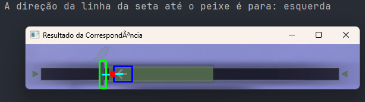
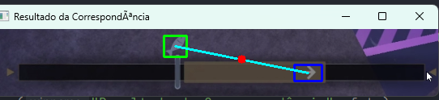

# 🐟 FarmPeixe - Fish Detection System

**YOLOv5-based object detection system for aquatic environments**

> Computer Vision project demonstrating end-to-end ML pipeline: data collection → annotation → training → inference

[](https://www.python.org/)
[](https://pytorch.org/)
[](https://github.com/ultralytics/yolov5)
[](https://roboflow.com/)

---

## 📋 Project Overview

FarmPeixe is a fish detection and tracking system built with YOLOv5, designed to identify and classify aquatic objects in different scenarios. This project demonstrates the complete machine learning workflow from data annotation to model deployment.

### 🎯 Objectives
- Detect and classify fish in various aquatic environments
- Handle multiple object classes (fish, ball, arrows/directions)
- Practice professional data labeling workflows
- Understand the impact of annotation quality on model performance

---

## 🛠️ Tech Stack

| Component | Technology |
|-----------|-----------|
| **Deep Learning Framework** | PyTorch |
| **Object Detection Model** | YOLOv5 |
| **Data Annotation** | Roboflow |
| **Computer Vision** | OpenCV |
| **Language** | Python 3.8+ |

---

## 📊 Dataset & Annotation

### Annotation Tool: Roboflow

Professional-grade data labeling using **Roboflow** platform:


*Example: Fish with directional indicator (left)*


*Example: Fish with directional indicator (right)*


*Example: Basic fish detection with bounding box*

### Dataset Statistics
- **Images Annotated**: ~50-100 images
- **Classes**: 3 (fish, ball, directional arrows)
- **Annotation Time**: ~3-5 hours
- **Tool**: Roboflow (bounding box annotations)
- **Export Format**: YOLOv5 PyTorch

---

## 🔄 ML Pipeline

```
1. Data Collection
   ↓
2. Annotation (Roboflow)
   ↓
3. Data Export (YOLO format)
   ↓
4. Model Training (YOLOv5 + PyTorch)
   ↓
5. Validation & Testing
   ↓
6. Inference & Deployment
```

---

## 💡 Key Learnings

### 1. **Annotation Consistency is Critical**
- Initial inconsistency in labeling partially visible objects affected model accuracy
- Learned to establish clear annotation guidelines before starting
- **Solution**: Defined strict rules (e.g., "label only 80%+ visible objects")

### 2. **Quality > Quantity**
- Better to have 50 perfectly labeled images than 200 inconsistent ones
- Re-annotated portions of dataset after identifying errors during training

### 3. **Iterative Improvement**
```
Annotate → Train → Evaluate → Re-annotate problematic cases → Retrain
```

### 4. **Professional Tools Matter**
- Roboflow significantly sped up annotation workflow
- Export formats (YOLO, COCO, etc.) save hours of preprocessing
- Version control for datasets is as important as code version control

---

## 🚀 Project Structure

```
FarmPeixe/
├── docs/                    # Documentation images
│   ├── direita.png         # Right direction example
│   ├── esquerda.png        # Left direction example
│   └── peixe.png           # Fish detection example
├── situacoes/              # Different detection scenarios
├── main.py                 # Main detection script
├── peixe1.py              # Fish detection variant 1
├── peixe2.py              # Fish detection variant 2
├── bola.png               # Ball detection asset
├── peixe.png              # Fish asset
├── seta.png               # Arrow asset 1
└── seta2.png              # Arrow asset 2
```

---

## 🎓 Skills Demonstrated

### Technical Skills
- ✅ Data annotation using professional tools (Roboflow)
- ✅ YOLOv5 model training and fine-tuning
- ✅ PyTorch framework proficiency
- ✅ Computer Vision fundamentals
- ✅ Object detection pipeline understanding

### Professional Skills
- ✅ Attention to detail in data labeling
- ✅ Quality assurance and validation
- ✅ Iterative problem-solving
- ✅ Documentation and knowledge sharing
- ✅ Understanding ML production workflows

---

## 🎯 Relevance to Data Labeling Roles

This project demonstrates:

1. **Hands-on annotation experience** with industry-standard tools
2. **Understanding of how labeling quality impacts model performance**
3. **Ability to maintain consistency** across large datasets
4. **Knowledge of the complete ML pipeline**, not just isolated tasks
5. **Proactive problem-solving** when identifying annotation issues

---

## 📈 Future Improvements

- [ ] Expand dataset to 500+ images
- [ ] Implement data augmentation strategies
- [ ] Add multi-class tracking across video frames
- [ ] Deploy model as web API
- [ ] Create annotation guidelines document
- [ ] A/B test different annotation strategies

---

## 🤝 Applications

This detection system can be applied to:
- **Aquaculture**: Monitoring fish behavior in farms
- **Marine Biology**: Tracking fish populations
- **Aquarium Management**: Automated fish counting
- **Education**: Teaching ML/CV concepts

---

## 👨‍💻 Author

**Leoni Frazão de Oliveira**
- 🎓 Computer Science & Technology @ UFABC
- 💼 Focus: Machine Learning, Computer Vision, AI
- 📧 leoni.frazao.oliveira@gmail.com
- 🔗 [LinkedIn](https://www.linkedin.com/in/leonifrazao/)
- 💻 [GitHub](https://github.com/leonifrazao/)

---

## 📝 License

This project is for educational and portfolio purposes.

---

## 🙏 Acknowledgments

- **Roboflow** for providing excellent annotation tools
- **Ultralytics** for the YOLOv5 implementation
- **PyTorch** community for comprehensive documentation

---

**⭐ If you found this project interesting, consider giving it a star!**

---

*Built with passion for Computer Vision and Machine Learning* 🚀
